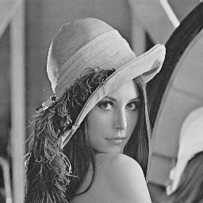
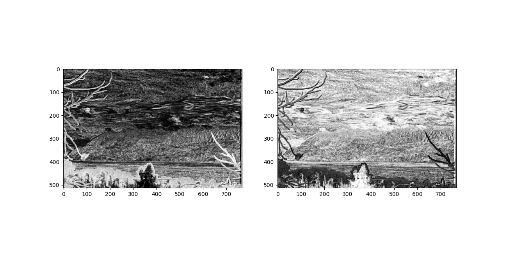

# Gaussin-Laplacian-pyramid-fusion

This code is an implementation of Gaussian and Laplacian pyramids and the fusion visible and NIR images according to [Vanmali et al article](https://www.ias.ac.in/article/fulltext/sadh/042/07/1063-1082).

## Requirements

This code works with Python 3 and requires the following libraries:
* matplotlib `pip install matplotlib`
* skimage `pip install skimage`
* numpy `pip install numpy`
* sklearn `pip install sklearn`
* scipy `pip install scipy`

## Experiments

### Classical Laplacian and Gaussian pyramids

To get the Gaussian and Laplacian pyramids of an image as well as the reconstruction of an image, run the following script:

`python main.py`

You may want to change the path of the image in the script and call the function `main_gaussian_laplacian_pyramids(image, kernel, levels)`.

The obtained results are below for the Lenna example:

**Original image**

**Gaussian pyramid**

**Laplacian pyramid**

**Reconstruction**

This program works for grayscale and three channels images.

### Visible and NIR fusion using fused Laplacian pyramids

All the equations used to implement NIR and visible fusion can be found in [Vanmali et al article](https://www.ias.ac.in/article/fulltext/sadh/042/07/1063-1082).

To achieved image visibility enhancement using fused Laplacian pyramids applied to NIR and visible images, run the following script:

`python main.py`

You may want to change the path of the image in the script and call the function `main_multimodal_fusion(im_vis, im_ir, kernel, levels, window_size)`.

The obtained results are below for the landscape example:

**On the left, value channel from HSV, on the right NIR image**

**From left to right : local entropy, local contrast and visibility. First row is value channel from HSV and second row is NIR image**

**Weights normalization, on the left value channel weight from HSV and on the right NIR image weight**

**Fused Laplacian pyramid**

**On th left, visible RGB image before transformation, on the right, NIR and visible image fusion displayed in the visible RGB format**
